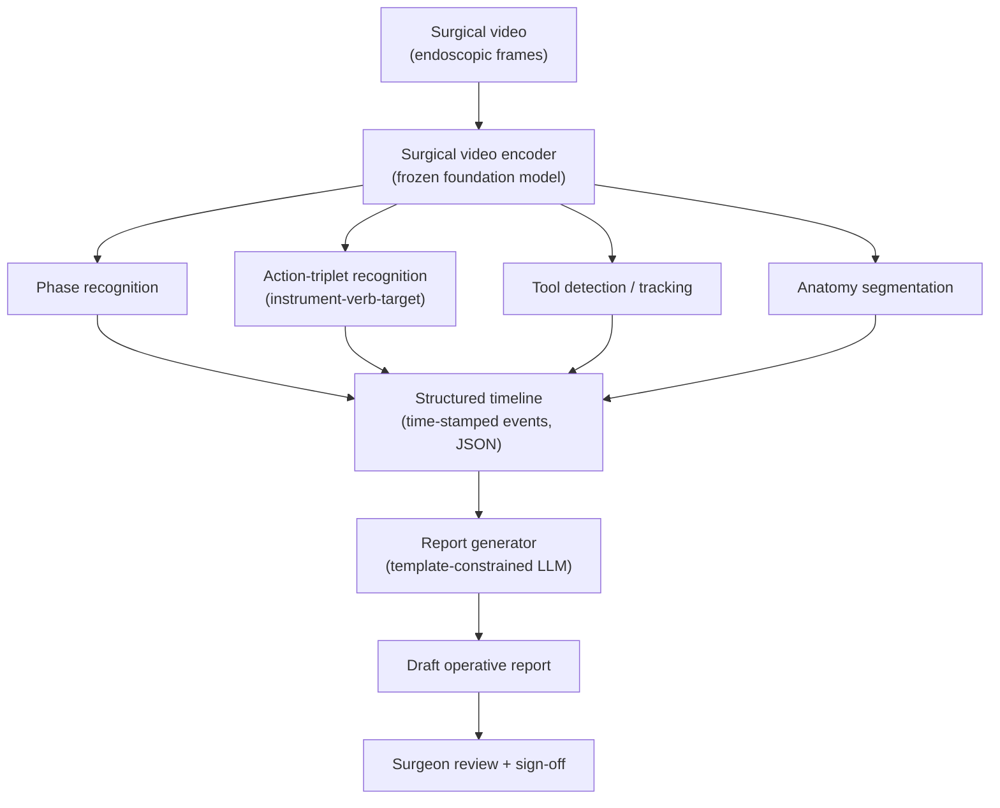
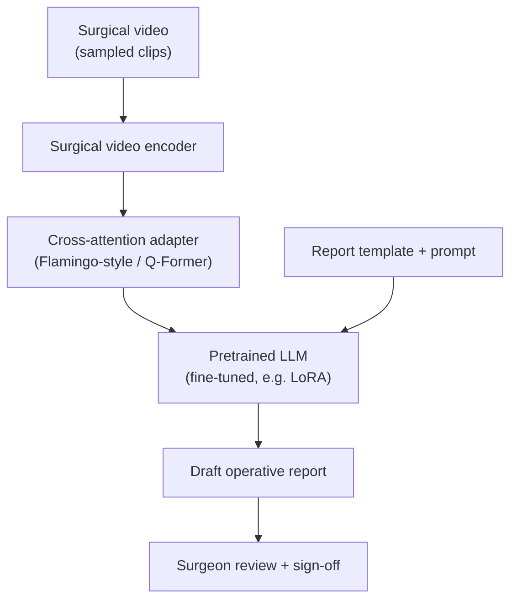

# Operative Report Generation from Surgical Video

> A system that turns endoscopic surgical video into a structured **draft operative report** that a surgeon reviews, completes, and signs. Video is the only required input.

`v1 scope: vision-only` · `output: draft + surgeon sign-off` · `first procedure: lap. cholecystectomy`

**[Read the rendered HTML version →](./operative-report-spec.html)** — single-page layout with live diagrams (open in a browser, or serve via GitHub Pages).

---

## Contents

- [1. Summary](#1-summary)
- [2. Problem and scope](#2-problem-and-scope)
- [3. Goals and non-goals](#3-goals-and-non-goals)
- [4. Key design decisions](#4-key-design-decisions)
- [5. Data plan](#5-data-plan)
- [6. Core data model](#6-core-data-model)
- [7. Evaluation and success criteria](#7-evaluation-and-success-criteria)
- [8. Roadmap (phased steps)](#8-roadmap-phased-steps)
- [9. Architecture A: Modular pipeline](#9-architecture-a-modular-pipeline)
- [10. Architecture B: End-to-end surgical VLM](#10-architecture-b-end-to-end-surgical-vlm)
- [11. Choosing between them](#11-choosing-between-them)
- [12. Key risks](#12-key-risks)
- [13. Reference appendix](#13-reference-appendix)

---

## 1. Summary

A system that ingests endoscopic video from a surgical procedure (robotic or laparoscopic) and produces a structured **draft operative report** describing what was done and what was found. The video is the only required input. The output is a draft that a surgeon reviews, completes, and signs — not an autonomous final document.

The technical core is a two-step idea: first recognize *what is happening* in the video as a stream of discrete, time-stamped events (surgical phases and action triplets); then turn that structured event stream into operative-report prose.

## 2. Problem and scope

Surgeons spend meaningful time dictating or writing operative notes after each case. Much of the content of those notes describes observable intraoperative activity — the steps performed, instruments used, structures handled, and findings — which is exactly what a model watching the video could reconstruct. Automating the *draft* reduces documentation burden while keeping the surgeon as the accountable author.

**In scope (v1):** the technique and findings narrative — the parts of the report that are visible in the operative field.

**Out of scope (v1):** report fields that are not derivable from video, including patient identifiers, indication, consent, estimated blood loss (beyond rough qualitative cues), specimen disposition, and instrument/sponge counts. These are left as templated placeholders for the surgeon to complete.

## 3. Goals and non-goals

**Goals**

- Generate a faithful, structured draft of the technique/findings sections from video alone.
- Be vendor- and modality-agnostic: run on any endoscopic video, robotic or laparoscopic, any camera.
- Keep every stage inspectable so errors can be traced to a specific component.
- Keep the surgeon in the loop as the final author.

**Non-goals**

- No autonomous, unsupervised report finalization.
- No dependency on proprietary robot telemetry (e.g. da Vinci kinematic logs) in v1. Kinematics is treated as a later accuracy upgrade, not a requirement.
- No claim to fill fields that are not observable in the video.

## 4. Key design decisions

1. **Vision-first.** The product runs on video, which generalizes across robots, vendors, and even laparoscopic cases, and avoids dependence on vendor-gated kinematic data streams.
2. **Draft, not final.** The deliverable is a draft requiring surgeon sign-off. This is both a safety requirement (hallucinated operative detail is a real harm) and a regulatory simplification.
3. **One procedure first.** Build and validate end-to-end on a single, data-rich procedure (laparoscopic cholecystectomy) before generalizing. Port to a robotic procedure (radical prostatectomy) second.
4. **Structured intermediate representation.** A machine-readable event timeline sits between perception and language generation. It is the contract between the two halves of the system, the thing you validate, and the thing a surgeon could audit.

## 5. Data plan

### 5.1 Public datasets (prototyping and benchmarking)

| Dataset | Procedure | Real cases? | Key labels | Access |
|---|---|---|---|---|
| Cholec80 | Lap. cholecystectomy | Yes | Phases, tool presence | Request form (CAMMA) |
| CholecT50 / T45 | Lap. cholecystectomy | Yes | Action triplets ⟨instrument, verb, target⟩ + phases | Request form (CAMMA) |
| CholecSeg8k | Lap. cholecystectomy | Yes | Segmentation masks | Kaggle |
| SAR-RARP50 | Robotic radical prostatectomy | Yes (in-vivo, da Vinci Si) | Action recognition + instrument segmentation | Open (UCL Figshare) |
| JIGSAWS | Bench-top robotic tasks | No (dry lab) | Gestures, skill, (kinematics) | Open (JHU CIRL) |

**Links**

- CAMMA datasets — https://camma.unistra.fr/datasets/
- CholecT50 repo — https://github.com/CAMMA-public/cholect50
- Cholec80 handling — https://github.com/CAMMA-public/TF-Cholec80
- SAR-RARP50 — https://rdr.ucl.ac.uk/projects/SAR-RARP50_Segmentation_of_surgical_instrumentation_and_Action_Recognition_on_Robot-Assisted_Radical_Prostatectomy_Challenge/191091
- JIGSAWS — https://cirl.lcsr.jhu.edu/research/hmm/datasets/jigsaws_release/

Larger/newer corpora to track as the project scales: Surg-3M (arXiv 2503.19740), HSA-27k / Halsted Surgical Atlas subset (arXiv 2603.22583), SurgPub-Video (arXiv 2508.10054).

### 5.2 The data that does not exist publicly

Paired *(video → real operative report)* data is the true bottleneck. Public datasets give labels for perception but not the target narrative. The acquisition strategy doubles as customer development: partner with one or two surgeons or a single department who already record endoscope video and write or dictate op notes per case. A few hundred cases of *one* procedure, de-identified and paired with the real report, beats any scraped corpus and becomes a defensible data asset.

### 5.3 Governance

Surgical video is protected health information. Build for de-identification, IRB/ethics approval, and a signed data-use agreement (BAA) from day one. Note that the public research datasets above carry research-use licenses — fine for prototyping and publication, but verify terms before shipping anything commercial.

## 6. Core data model

The structured timeline is the heart of the system. Each event is a time-stamped, typed record. The **action triplet** ⟨instrument, verb, target⟩ is the atomic unit — essentially a sentence of the operative note in structured form.

Example event:

```json
{
  "t_start": 1423.5,
  "t_end": 1457.2,
  "phase": "calot_triangle_dissection",
  "triplet": {
    "instrument": "hook",
    "verb": "dissect",
    "target": "cystic_artery"
  },
  "confidence": 0.91
}
```

A procedure becomes an ordered list of such events plus phase boundaries. The report generator consumes this list, not the raw video.

## 7. Evaluation and success criteria

- **Perception layer:** standard metrics on public benchmarks — phase accuracy and Jaccard, triplet mAP, tool/segmentation scores.
- **Report quality:** automatic text metrics (ROUGE, BERTScore) against held-out real op notes, but these are weak. The primary metric is **blinded surgeon review** scoring drafts on factual accuracy, completeness, hallucination rate, and edit distance to a sign-off-ready note.
- **Top-line success:** a surgeon spends meaningfully less time producing a final note from the draft than writing from scratch, with no factual errors surviving to sign-off.

## 8. Roadmap (phased steps)

Each phase is gated by a single riskiest assumption stated as a falsifiable hypothesis. The phase is not "done" when the work is built — it is done when the hypothesis is confirmed. A refuted hypothesis is a signal to pivot or stop, not to push harder, and it is cheaper to learn early. Each phase therefore tests the assumption that, if false, would invalidate the phases after it.

### Phase 0 — Scoping

Lock the target procedure (lap. cholecystectomy), report template, and event schema. Secure dataset access and a design-partner surgeon.

- **Hypothesis:** The technique/findings content of a real operative note for this procedure can be expressed as a sequence of observable phases and action triplets — i.e. the report is reconstructible from what the camera sees.
- **How to test:** Take a sample of real op notes; have a surgeon map each technique/findings sentence to phase/triplet events. Measure the fraction grounded in observable events vs. requiring non-visual information.
- **Kill criterion:** if a large share of the narrative depends on non-visual knowledge, the video-only premise is wrong.

### Phase 1 — Perception

Fine-tune lightweight heads on a frozen surgical video backbone for phase and triplet recognition using Cholec80 + CholecT50.

- **Hypothesis:** A frozen pretrained surgical backbone plus lightweight heads reaches usable phase and triplet accuracy — we do not need to pretrain or train end-to-end from scratch.
- **How to test:** Benchmark against published SOTA on Cholec80/CholecT50 with a pre-registered "usable" threshold.
- **Kill criterion:** if attentive probing on a frozen backbone lands far below threshold, the cheap-transfer assumption fails and cost/scope change materially.

### Phase 2 — Timeline

Convert per-frame predictions into a clean, de-noised, time-stamped event list (smoothing, segment merging, confidence thresholds).

- **Hypothesis:** Noisy per-frame predictions can be post-processed into an event timeline accurate enough that downstream report errors are dominated by *perception* accuracy, not by timeline construction.
- **How to test:** Compare constructed timelines against ground-truth annotations (event boundary precision/recall) and attribute downstream errors to perception vs. timeline-building.
- **Kill criterion:** if timeline construction is itself a large independent error source, the clean intermediate-representation assumption is weaker than designed.

### Phase 3 — Report generation

Build a template-constrained LLM stage that maps the timeline to technique/findings prose, forbidding claims not grounded in events.

- **Hypothesis:** Given an *accurate* timeline, a constrained LLM produces prose surgeons rate as faithful and near sign-off ready, with effectively zero ungrounded claims.
- **How to test:** Feed ground-truth ("oracle") timelines to the generator and have surgeons rate faithfulness, completeness, and hallucination rate — this isolates the language stage from perception error.
- **Kill criterion:** if even oracle input yields hallucinations or unusable prose, the generation approach (not perception) is the blocker.

### Phase 4 — Validation

Blinded surgeon review of the full (non-oracle) pipeline against real op notes.

- **Hypothesis:** With the real end-to-end pipeline, a surgeon produces a final note from the draft in meaningfully less time than writing from scratch, with no factual error surviving to sign-off.
- **How to test:** Timed within-surgeon comparison (draft-assisted vs. from scratch) plus a factual-error audit of signed notes.
- **Kill criterion:** no net time saving, or errors reaching sign-off, means the product value proposition is unproven.

### Phase 5 — Robotic + paired data

Port the pipeline to SAR-RARP50; begin collecting paired video↔report data from the design partner.

- **Hypothesis A (transfer):** The architecture ports to a robotic procedure with retraining but no redesign — the approach is procedure-general, not lap-chole-specific.
- **Hypothesis B (acquisition):** Design-partner surgeons reliably supply de-identified paired video↔report at a usable rate and completeness.
- **How to test:** Replicate Phase 1–4 metrics on SAR-RARP50; track actual paired cases per week and pairing completeness over a pilot.
- **Kill criterion:** a redesign is needed per procedure (no generality), or the data pipeline yields too few/too incomplete pairs to train on.

### Phase 6 — Advanced

Explore the end-to-end VLM (Architecture B) once paired data exists; later evaluate adding kinematics as a second modality.

- **Hypothesis A (VLM):** Given the accumulated paired data, an end-to-end VLM beats the modular pipeline on surgeon-rated report quality by enough to justify its lower auditability.
- **Hypothesis B (kinematics):** Adding kinematics as a second modality improves action/gesture recognition or report accuracy enough to justify the data-access cost.
- **How to test:** Head-to-head modular vs. VLM on held-out cases; ablation with/without kinematics on a procedure where both are available.
- **Kill criterion:** no quality gain over the modular pipeline (stay modular), or no measurable lift from kinematics (don't pay for the access).

## 9. Architecture A: Modular pipeline

> Recommended for v1.

Perception and language are separate, connected by the structured timeline. This is the lower-risk, more debuggable path and the recommended starting point.



**Components**

- *Video encoder:* a pretrained surgical video foundation model used as a frozen feature extractor (e.g. SurgVISTA, SurgeNetXL, EndoFM). Provides temporal features without training from scratch.
- *Perception heads:* lightweight, separately trainable heads for phase, triplet, tool, and anatomy tasks (attentive probing / adapters on the frozen backbone).
- *Timeline builder:* deterministic post-processing — temporal smoothing, segment merging, confidence gating — producing the event list.
- *Report generator:* an LLM prompted with the event list and the report template, constrained to ground every statement in an event.

**Pros**

- Each stage is independently testable and benchmarkable.
- Errors are traceable to a specific component.
- The timeline is auditable by a clinician.
- Lower hallucination risk — the LLM describes a structured input rather than free-associating from pixels.
- Smaller data requirements; leans on existing labeled perception datasets.

**Cons**

- Errors compound across stages (a missed triplet never reaches the report).
- Information not captured in the schema is lost before the language stage.
- More moving parts to build and maintain.

## 10. Architecture B: End-to-end surgical VLM

A surgical vision-language model maps video directly to report text, with no explicit intermediate representation. This follows the pattern of recent surgical VLMs (e.g. Surgical-LVLM, GP-VLS, Halsted) and the broader "modality-encoder into a frozen LLM" recipe (e.g. Flamingo-style cross-attention, as implemented in time-series LMs like OpenTSLM).



**Components**

- *Video encoder:* same family of surgical backbone as Architecture A, producing visual tokens.
- *Adapter:* a cross-attention module (Flamingo-style) or a Q-Former that injects visual tokens into the language model's attention. This is the piece that "teaches" the LLM to attend to video.
- *Language model:* a pretrained LLM fine-tuned (typically with LoRA) to emit the report, conditioned on visual tokens and a prompt carrying the report template.

**Pros**

- No information lost to a fixed intermediate schema; the model can use subtle visual cues.
- Fewer components once trained; a single fine-tuning objective.
- Benefits directly from advances in general VLM architectures.

**Cons**

- Requires paired (video → report) training data, which is scarce and must be built.
- Harder to validate and to constrain; higher hallucination risk.
- A "black box" — failures are difficult to localize or explain to a clinical reviewer.
- Long procedures stress the temporal/sequence-length limits of current VLMs.

## 11. Choosing between them

| Dimension | A — Modular | B — End-to-end VLM |
|---|---|---|
| Build risk | Lower | Higher |
| Debuggability | High (per-stage) | Low (black box) |
| Hallucination control | Strong (grounded in events) | Weaker |
| Data needs | Existing labeled perception sets | Scarce paired video↔report |
| Clinical auditability | High (timeline is inspectable) | Low |
| Ceiling on quality | Capped by the schema | Potentially higher |

**Recommendation:** build Architecture A for v1 to reach a validated, auditable product quickly and to start accumulating paired data. Treat Architecture B as a phase-6 research track that becomes viable once paired data exists — and note the two share the same video encoder, so the investment carries over. A hybrid is also natural: use Architecture A's structured timeline as grounding context for a VLM, getting the auditability of A with some of the expressiveness of B.

## 12. Key risks

- **Compounding perception errors** in Architecture A — mitigated by confidence gating and surgeon review.
- **Hallucinated operative detail** — mitigated by event-grounded generation, output constraints, and mandatory sign-off.
- **Paired-data scarcity** — mitigated by the design-partner acquisition strategy.
- **Regulatory and privacy exposure** — mitigated by de-identification, IRB/BAA, and positioning as documentation support with a human author.
- **Generalization** across surgeons, hospitals, and equipment — mitigated by starting narrow (one procedure) and expanding deliberately.

## 13. Reference appendix

- **Surgical video backbones:** SurgVISTA, SurgeNetXL, EndoFM, SurgMotion.
- **Surgical VLMs (text output):** GP-VLS, Surgical-LVLM, SurgVLM, Halsted.
- **Perception task line:** CholecTriplet challenges (action-triplet recognition), EndoVis challenges (segmentation).
- **Architectural reference for the adapter pattern:** OpenTSLM (time-series modality into a frozen LLM via soft-prompt or Flamingo-style cross-attention) — directly applicable if/when kinematics is added as a second modality.

